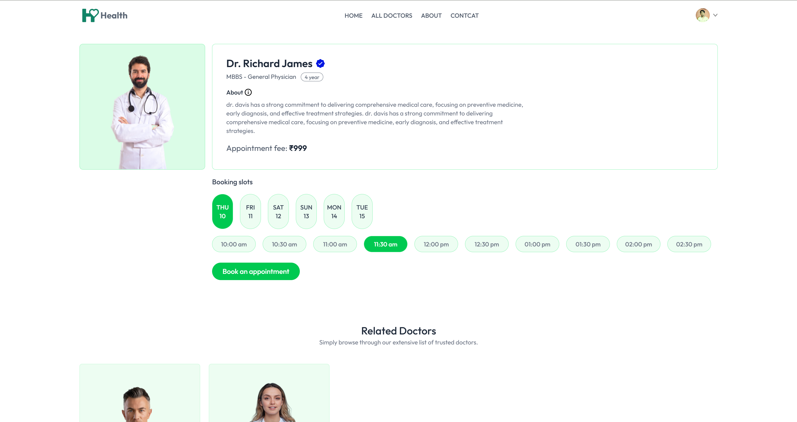
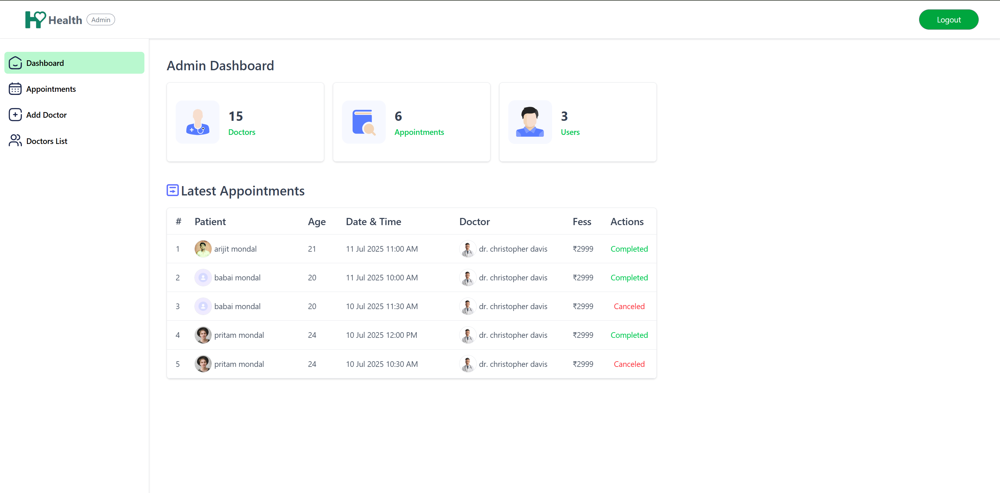

# 🧑‍⚕️ Health

**Health** is a user-friendly web application designed to simplify the process of finding, booking, and managing doctor appointments online. Patients can easily search for healthcare professionals by specialty and availability, then book appointments in just a few clicks.

---

## 🌐 Live Demo

- 👉 [View Live Frontend](https://your-live-frontend-link.com)
- 👉 [View Live Admin/Doctor Dashboard](https://your-live-admin-link.com)

---

## 🖼️ Screenshots

**Home Page**  


**Appointment Booking**  


**Admin Dashboard**  


---

## 📚 Tech Stack

**Frontend Tech Stack:**

- **React.js:** For building an interactive, component-based single-page application with fast client-side routing.

- **Redux Toolkit:** For managing and sharing global state (like auth, user data, appointments) across components in an efficient way.

- **Tailwind CSS:** For designing a clean, responsive, mobile-friendly UI using utility-first CSS classes.

- **Axios:** For making secure API requests to the backend (register/login, fetch doctors, create/cancel bookings).


**Backend Tech Stack:**

- **Node.js:** Runs the server and handles API requests asynchronously.

- **Express.js:** Provides a robust routing system and middleware for building the REST API.

- **MongoDB:** Stores all user, doctor, appointment, and transaction data with flexible schemas.

- **jsonwebtoken (JWT):** Secures user authentication and protects routes with token-based access.

- **Cloudinary:** Manages secure cloud storage for user and doctor profile images.

- **Multer:** Handles image uploads from the client and passes them to Cloudinary.

- **Razorpay:** Processes online payments for appointment bookings.

- **bcrypt:** Hashes passwords to ensure secure user data storage.


---

## ✨ Features

- ✅ User registration & authentication  
- ✅ Browse doctors by specialty  
- ✅ Book, reschedule, or cancel appointments  
- ✅ Doctor dashboard for managing schedules  
- ✅ Admin dashboard for managing users and appointments

---

## ⚙️ Installation

1️⃣ **Clone the repository**
```bash
git clone https://github.com/your-username/health-appointment-app.git
cd health-appointment-app
```

2️⃣ **Install dependencies**
```bash
# Backend
cd backend
npm install

# Frontend
cd ../frontend
npm install

# Admin
cd ../admin
npm install
```
3️⃣ **Add environment variables**
```bash
# Create a .env file in the backend directory and add them:
PORT = "4000"
CORS_ORIGIN = "*"
MONGODB_URI = "*******************"
JWT_SECRET = "*******************"
JWT_EXPIRY = "**"
CLOUDINARY_CLOUD_NAME = "*******************"
CLOUDINARY_API_KEY = "*******************"
CLOUDINARY_API_SECRET = "*******************"
RAZORPAY_KEY_ID = "*******************"
RAZORPAY_SECRET_KEY = "*******************"
CURRENCY = "***"

# Create a .env file in the frontend directory and add them:
VITE_BACKEND_URL = "http://localhost:4000"
VITE_RAZORPAY_KEY_ID = "add your"

# Create a .env file in the admin directory and add them:
VITE_BACKEND_URL = "http://localhost:4000"
```
4️⃣ **Run the application**
```bash
# Backend
npm run dev

# Frontend
npm run dev

# Admin
npm run dev
```
---

🤝 **Contributing** Contributions are welcome!

- Fork this repository
- Create a new branch (git checkout -b feature/your-feature)
- Commit your changes (git commit -m 'Add new feature')
- Push to your branch (git push origin feature/your-feature)
- Open a Pull Request

---

📬 **Contact**

Created by [Arijit Mondal](https://github.com/your-username) — feel free to reach out!